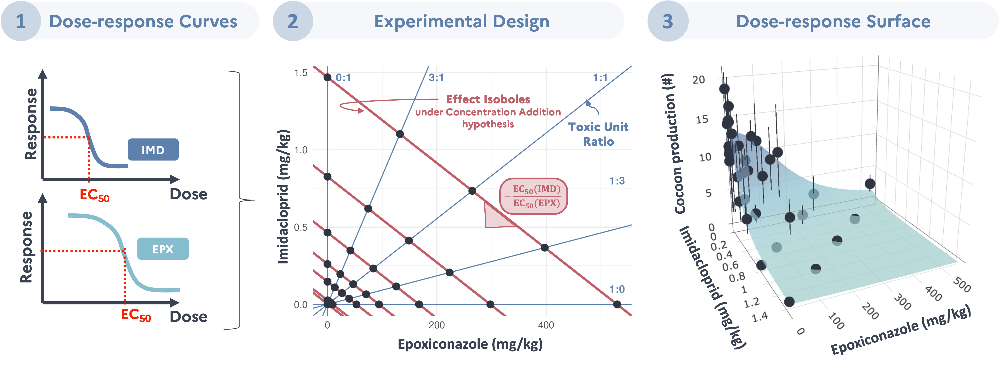

# Information about this project

A preprint of this work is available [here](https://hal.science/hal-05512403).

## Abstract



Soils are essential biodiversity reservoirs and providers of key ecosystem services, yet they are increasingly threatened by agricultural intensification and widespread pesticide use. Residues often persist as complex mixtures, while environmental risk assessment typically focuses on single substances, potentially overlooking mixture effects. Earthworms, as major soil engineers, are central to soil functioning and particularly vulnerable to pesticide contamination. We assessed the effects of a binary mixture of epoxiconazole (a triazole fungicide) and imidacloprid (a neonicotinoid insecticide) on life-history traits of Aporrectodea caliginosa, two pesticides frequently detected and persistent in agricultural soils. Individual dose–response experiments were first conducted on juvenile growth and cocoon production to estimate relative potency. Mixture effects were then examined using a fixed-ratio ray design with five concentration ratios and seven additive isoboles (36 conditions). Adult growth and cocoon production were monitored for 28 days, followed by hatching assessment over 56 days. Both compounds showed significant toxicity. Imidacloprid exhibited high potency (growth: NOEC = 0.28 mg/kg; reproduction: NOEC = 0.89 mg/kg; EC50 = 0.55 mg/kg), while epoxiconazole induced moderate effects (growth: NOEC = 9.3 mg/kg; reproduction: NOEC = 92.8 mg/kg; EC50 = 126.8 mg/kg). Reproductive endpoints were more sensitive than adult growth, and juvenile growth emerged as the most sensitive endpoint, underscoring the vulnerability of early life stages. Mixture analysis using Jonker’s models showed that only the simple interaction model significantly deviated from the Independent Action (IA) reference, indicating synergistic interactions consistent with reports of cytochrome P450 metabolic interference in other taxa. Environmentally, field-reported imidacloprid concentrations often approach experimentally derived effect thresholds, highlighting a potential risk for earthworm populations even under current regulatory conditions. Overall, the combined effects of epoxiconazole and imidacloprid may exceed predictions based on simple additivity. These findings emphasize the need to account for mixture effects and potential synergism in environmental risk assessment frameworks, particularly for pesticide combinations likely to co-occur in soils.

## Preliminary information about this study

This study is part of the french [ANR project EEWORM](https://eeworm-website-eeworm-28029feb17f172b5d59fe25680d42ab1a87633fff.pages-forge.inrae.fr).

### Contributors

**Authors of this study** (Credit synthaxe) :

-   [Lisa Gollot](https://orcid.org/0009-0004-5074-4275) : Conceptualization, Data curation, Formal Analysis, Investigation, Methodology, Software, Validation, Visualization, Writing – Original Draft Preparation.
-   [Cleo Bodin](https://orcid.org/0000-0003-3470-157X) : Formal Analysis, Methodology, Resources, Software.
-   Laura Frattaroli (INRAE research technician) : Data curation, Investigation, Methodology, Writing – Review & Editing.
-   [Rémy Beaudouin](https://orcid.org/0000-0002-2855-1571) : Formal Analysis, Funding Acquisition, Methodology, Resources, Supervision, Writing – Review & Editing.
-   [Raphaël Royauté](https://rroyaute.github.io)\$ : Conceptualization, Funding Acquisition, Methodology, Project Administration, Resources, Supervision, Writing – Review & Editing.
-   [Juliette Faburé](https://orcid.org/0000-0002-8055-3224) : Funding Acquisition, Methodology, Resources, Supervision, Writing – Review & Editing.

**Interns who also contributed to this study** :

-   Maia Colombel (L3 internship) : Earthworms breeding & Imidacloprid dose-response curves (May - June 2024)
-   Julien Rouyer (Gap year intership of engineering school) : Earthworms breeding & Mixture tests (October - December 2024)
-   Cheikh Ahmed Tidane Sarr (M2 intership) : Mixture tests (March - August 2025)

### Fundings

This work was funded by the French National Research Agency (ANR) through the project EEWORM (N°ANR-23-CE34-0002) and the Biosphera graduate school of the University Paris-Saclay (PhD Grant).

### GANTT {#sec-GANTT}

```{r,, include=F}
# Load necessary libraries
library(ggplot2)
library(dplyr)
library(lubridate)
library(forcats)
library(nord)

Nord_frost <- nord(palette = "frost")
Nord_aurora <- nord(palette = "aurora")
Nord_polar <- nord(palette = "polarnight")
```

```{r, echo=F, warning=F}
#| fig-cap: GANTT
#| label: fig-GANTT
#| fig-width: 10
#| fig-height: 4

# Sample data
data_gantt <- data.frame(
  task = c(
    "1. Preliminary tests",                      # 1
    "2.1. EC50 tests for IMD",                   # 2
    "2.2. EC50 tests for EPX",                   # 3
    "3.1. Mixture tests - Autumn 2024",          # 4
    "3.2. Mixture tests - Small test with IMD",  # 5
    "3.3. Mixture tests - Spring 2025",          # 6
    "3.3. Mixture tests - Hatchling monitoring"  # 7
  ),
  start_date = as.Date(
    c(
      "2024-03-05",                              # 1
      "2024-03-01",                              # 2
      "2024-05-03",                              # 3
      "2024-10-14",                              # 4
      "2025-01-07",                              # 5
      "2025-03-25",                              # 6
      "2025-04-30"                               # 7
    )
  ),
  end_date = as.Date(
    c
    ("2024-04-19",                               # 1
      "2024-07-08",                              # 2
      "2024-07-08",                              # 3
      "2024-12-18",                              # 4
      "2025-02-05",                              # 5
      "2025-04-30",                              # 6
      "2025-06-10"                               # 7
    )
  ),
  status = c(
    "Completed",                                 # 1
    "Completed",                                 # 2
    "Completed",                                 # 3
    "Completed",                                 # 4
    "Completed",                                 # 5
    "Completed",                                 # 6
    "Completed"                                  # 7
  )
)

# Custom color palette for the statuses

status_colors <- c("In Progress" = Nord_frost[1], "Completed" = Nord_frost[4])

# Creating the Gantt chart
ggplot(
  data_gantt, 
  aes(
    x = start_date, 
    # y = reorder(task, -as.numeric(start_date))
    y = fct_rev(task)
  )
) +  # Reorder tasks
  
  geom_segment(
    aes(
      xend = end_date, 
      yend = task, 
      color = status
    ), 
    size = 6, 
    lineend = "round",
    alpha = 0.7
  ) +  # Rounded bars
  
  geom_text(
    aes(
      x = ymd(start_date) + (ymd(end_date)-ymd(start_date))/2, 
      label = task,
    ),
    hjust = 0.5,
    vjust = -1.2,
    size = 4, 
    color = "black",
    fontface = "bold"
  )+
  
  scale_color_manual(values = status_colors) +  # Apply custom colors
  
  labs(
    title = "Project Timeline",
    x = NULL,  # Remove axis title for x
    y = NULL,  # Remove axis title for y
    color = "Status"
  ) +
  
  theme_minimal(base_family = "Arial") +                                          # Use a clean, sans-serif font
  theme(
    plot.title = element_text(size = 18, face = "bold", hjust = 0.5),             # Title style
    legend.position = "right",
    legend.title = element_text(size = 12),
    legend.text = element_text(size = 10),
    # axis.text.y = element_text(size = 12, hjust = 0, face = "bold"),                                        # Make task labels bold
    axis.text.y = element_blank(),
    axis.text.x = element_text(size = 10, color = "grey40"),                      # Date labels in grey
    panel.grid.minor = element_blank(),                                           # Remove minor grid lines
    panel.grid.major.y = element_blank(),                                         # Remove horizontal grid lines
    panel.grid.major.x = element_line(color = "grey85", linetype = "dashed")      # Subtle dashed vertical grid
  ) +
  scale_x_date(
    date_labels = "%b %Y", 
    date_breaks = "2 month", 
    expand = c(0, 0),
    limits = c(ymd("2024-02-01"), ymd("2025-10-31"))
    )  # Custom date formatting


```

## How to use this repository ?

### Repository organisation

The git repository linked to this website is available [here](https://github.com/LisaGllt/Ew-Mix-TD) and is saved via [SoftwareHeritage](https://archive.softwareheritage.org) on this [page](https://archive.softwareheritage.org/browse/origin/https://github.com/LisaGllt/Ew-Mix-TD).

Folders containing files concerning directly the study :

-   `data` folder : Contains the raw data files with direct notations from the experiments
-   `functions` folder : Contains R scripts with general functions used throughout different scripts
-   `quarto` folder : Contains all the `.qmd` files that generate the html pages, and their associated cache and files which cannot be moved to another folder.
-   `mod` folder : Contain all the models generated in `.rds` files
-   `bootstrap` folder : Contain the R script and its results concerning the bootstrap.
-   `photos` folder : Contains all photos used in html pages
-   `fig` folder : Contains all figure generated by quarto documents
-   `references` folder
    -   `apa.csl` : File of the reference style used for the website
    -   `reference.bib` : File containing all references from a zotero library

Folders concerning the setup of the git repository and the web pages :

-   `_book` : Where the final html pages are created
-   `index.qmd` : Home page of the web site (cannot be put in the `quarto` folder)
-   `_quarto.yaml` : YAML file that setup the structure of the website from the quarto (`.qmd`) documents
-   `_freeze` folder : Cache the results of code blocks (code cells) to avoid recalculating them on each execution
-   `.git`, `.gitignore` & `.github` : Git related folders
-   `.quarto` : Store configuration files, metadata, and intermediate files related to a Quarto project
-   `.Rproj.user` & `Ew-Mix-TD.Rproj` : R project related files
-   `appearance` folder :
    -   `html_css.scss` : CSS file to modify the look of the html pages
    -   `lightnord.theme` : Theme to use for code blocks displayed in the html pages

### How to reproduce everything

If you wish to reproduce the results of this study, all you need are available in the `quarto` folder and the `mod` folder.

Instructions :

-   Whether or not you want to run the models again, please delete the folders from the `quarto` folder that end by `_cache` or `_files` and delete all the figures present in the `fig` folder.
    -   If you do not want to run the models again, move on to the next step
    -   If you wish to run the models again, please delete the files in `mod` but the `.model` files and keep the arborescence)
-   Then, you can render again all .qmd files from the `quarto` folder in the alphabetical order of their name. Some code line will have to be de-commented for some figures to be rendered again.
