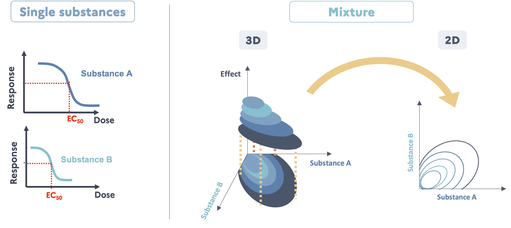
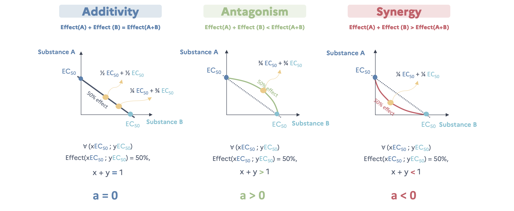
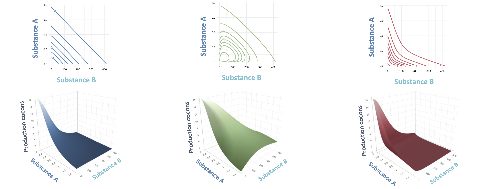

# How to study a binary mixture ? {#sec-howmix}

Considering mixtures, there are 3 possible outcomes in terms of toxic effects :

-   **Additivity** : Effect(A) + Effect(B) = Effect(A+B) (no interaction)
-   **Antagonisme** : Effect(A) + Effect(B) \> Effect(A+B) (positive interaction)
-   **Synergy** : Effect(A) + Effect(B) \< Effect(A+B) (negative interaction)

In ecotoxicology, the last case is the most concerning one as security levels determined on single substances can be insufficient to protect the environment.

## Graphical representations

As seen in the last section, when only one substance is studied at a time it gives us dose-reponse **curves** (2D : Dose x Effect). But when we study a binary mixture, we are looking to define a dose-response **surface** (3D : Dose substance A x Dose substance B x Effect). This surface can be displayed in 3D but also in 2D, under the same principle of level line in maps (@fig-schemedrcs).

{#fig-schemedrcs}

## Interaction model of Jonker, (2005)

Using the Jonker mixture interaction framework, mixture effects can be evaluated using two classical reference models: concentration addition (CA) and independent action (IA), which assume that the effects of two substances are predictable from their individual dose–response functions without any interaction. These models do not introduce additional parameters and serve as the null hypothesis. CA assumes that chemicals behave as dilutions of one another and is most appropriate when compounds share a similar mode of action. Because it sums “toxic units,” CA is generally considered conservative, often predicting stronger mixture effects even when modes of action differ. IA (response addition) assumes that chemicals act through independent modes of action. It predicts the probability of effect based on the individual dose–response functions and is typically less conservative than CA. Using both CA and IA provides a complementary, widely used framework to detect potential synergistic or antagonistic deviations from additivity. The use of IA is warranted given the mechanistic dissimilarity between the two compounds: imidacloprid functions as a nicotinic acetylcholine receptor agonist, while epoxiconazole disrupts sterol biosynthesis.

### General principle - Example of models with CA as reference

To model the dose-response surface of the binary mixture, we can use the simple interaction model of @jonker_2005 with concentration addition (CA) as reference. This model is based on the dose-response curves of the single substances and an interaction parameter, $a$. This parameter explicitly quantifies how much the observed dose–response surface departs from the additivity baseline. This formalism has the advantage of being continuous: interaction strength and direction are measured on a single scale, which avoids the dichotomy between “interactive” and “non-interactive” mixtures.

**Additivity (no interaction)**

In case of no interaction (null hypothesis), this model define the null model as the model describing the dose-response surface in the case of no interaction between the two substances. This model is based on the concentration addition principle (CA) and in this case $a$ = 0. Because effects are then additive, effect isobole, which describe the pairs of doses leading to the same given level of effect, are linear. For example, if we consider all pairs of doses leading to a 50% effect, each dose of a substance can be expressed as a fraction of its own EC$_{50}$ and the additivity is verified if the sum of the two fractions are equal to 1.

Additivity is verified in the case where @eq-CA is verified :

$$\forall (C_A,C_B)=(x\ EC_{50}^A\ ;\ y\ EC_{50}^B)\ \text{ with }\ \text{ Effect}(x\ EC_{50}^A\ ;\ y\ EC_{50}^B) = 50\%,\ x+y=1$$ {#eq-CA}

**Antagonism**

In the case of antagonism, @eq-CA is not verified anymore and isoboles are concave with $a$ \> 0. For example, if we consider all pairs of doses leading to a 50% effect, each dose of a substance can be expressed as a fraction of its own EC$_{50}$ and antagonism occurs if the sum of the two fractions are above 1. How above is quantified by $a$. We need more of the mixture to get an effect of 50%.

$$\forall (C_A,C_B)=(x\ EC_{50}^A\ ;\ y\ EC_{50}^B)\ \text{ with }\ \text{ Effect}(x\ EC_{50}^A\ ;\ y\ EC_{50}^B) = 50\%,\ x+y>1$$ {#eq-Antagonism}

**Synergy**

In the case of synergy, @eq-CA is also not verified and isoboles are convexe with $a$ \< 0. For example, if we consider all pairs of doses leading to a 50% effect, each dose of a substance can be expressed as a fraction of its own EC$_{50}$ and antagonism occurs if the sum of the two fractions are below 1. How below is quantified by $a$. We need less of the mixture to get an effect of 50%.

$$\forall (C_A,C_B)=(x\ EC_{50}^A\ ;\ y\ EC_{50}^B)\ \text{ with }\ \text{ Effect}(x\ EC_{50}^A\ ;\ y\ EC_{50}^B) = 50\%,\ x+y<1$$ {#eq-Synergism}

 

Two other more sophisticated models were developped by Jonker introducing an second interaction parameter ($b$) :

-   The **DL model** : Take into account the fact that the interaction can depend on the **level of effect**.
-   The **DR model** : Take into account the fact that the interaction can depend on the **ratio of the two substances** in the mixture.

### Formal mathematical definition

#### With CA as reference

Let $f_A$ and $f_B$ be the functions describing the dose-response curves of substance A and substance B, respectively.

In the case of no interaction, concentration addition implies the dose-response surface of the mixture of A and B can be expressed as all couple of concentration of substance A and substance B ($c_A$ ; $c_B$) as :

$$
\frac{c_A}{f^{-1}_A(Y)}+\frac{c_B}{f^{-1}_B(Y)}=1
$$ {#eq-CAbin}

The Jonker simple interaction model add the definition of an interaction parameter ($a$) so the dose-response surface of the mixture of A and B can be expressed as all ($c_A$ ; $c_B$) as :

$$
\frac{c_A}{f^{-1}_A(Y)}+\frac{c_B}{f^{-1}_B(Y)}=\text{exp}(G)
$$ {#eq-jonkerbin}

With :

$$
G(z_A, z_B)=a\times (z_A\times z_B)
$$ {#eq-jonkerbinGSA}

And :

$$
z_i=\frac{\text{TU}_{x_i}}{\text{TU}_{x_A}+\text{TU}_{x_B}},\ \text{ where }\  \text{TU}_{x_i}=\frac{c_i}{EC_{x_i}}
$$ {#eq-jonkerbinZ}

With :

-   $Y$ : The response for a given couple of concentrations,
-   $x$ : Usually 5, 10, ou 50 (50 used in this study),
-   $z_A$ & $z_B$ : Contribution of each substance to the overall effect,

For the SA model, the interaction parameter value describes the type of the interaction :

-   $a$ = 0 : Additivity,
-   $a$ \< 0 : Synergy,
-   $a$ \> 0 : Antagonisme.

The Jonker framework adds two other types of model, making it four models in total :

-   CA : Concentration addition, case with no interaction (@eq-CAbin)
-   SA : Simple interaction with constant deviation from additivity (@eq-jonkerbinGSA),
-   DL : Dose-level dependent interaction where effects vary with response magnitude (@eq-JonkerDLDR),
-   DR : Ratio-dependent interaction where effects vary with mixture composition (@eq-JonkerDLDR).

The DL and DR models include a second interaction parameter, $b$. The expression of $G$ is then :

$$
\begin{aligned}
G(z_Az_B) = \begin{cases}
a\,[1 - b_{DL}]\, z_A z_B & \text{(DL model)}\\[6pt]
(a + b_{DR} z_A)\, z_A z_B & \text{(DR model)}
\end{cases}
\end{aligned}
$$ {#eq-JonkerDLDR}

#### With IA as reference

Let $q_i$ be the function as $f_i(c_i) = Y_{max}\ q_i$.

With an endpoint inversely proportional to the dose, the Jonker interaction models can now be expressed as the following equations :

$$
Y = Y_{max}\Phi(\Phi^{-1}[q_A(c_A)*q_B(c_B)]+G)
$$ With :

-   $Y$ : The response for a given couple of concentrations ($c_A$ and $c_B$),
-   $Y_{max}$ : The maximum response (control response),
-   $q_i(c_i)$ : Non-response probability of substance $i$,
-   $\Phi$ : The standard cumulative normal distribution function.

And with :

$$
\begin{aligned}
G(z_A, z_B)=\begin{cases}
a\times z_A z_B & \text{for the SA model} \\
a[1-b\times q_A(c_A)\  q_B(c_B)]\ z_A z_B & \text{for the DL model} \\
(a+b\ z_A)\ z_Az_B & \text{for the DR model} \\
\end{cases}
\end{aligned}
$$

### Computational implementation

#### With CA as reference

In practice, the fit of the dose-response curve surface is a double optimization :

1.  For given set of interaction parameters, the corresponding effects must be found also numerically.
2.  Numerical optimization of the interaction parameters

To perform step 1, a function `CA_complete2()` was written. For a given set of interaction parameters, finding the corresponding efect for a couple of concentration ($c_A$ ; $c_B$) implies the minimization of the following term :

$$
\frac{c_A}{f^{-1}_A(Y)}+\frac{c_B}{f^{-1}_B(Y)}-\text{exp}(G)
$$ {#eq-minim}

For step 2, a function `CA_complete_fit_speed()` was written. Parameter estimation for the interaction models requires maximum likelihood estimation (MLE). The optimization procedure depends on the assumed error distribution: for normally distributed errors, this is equivalent to minimizing the residual sum of squares (calculated with the function `CA_complete2_RSS()`), while for Poisson-distributed errors, the log-likelihood function (@eq-LLPoisson) (calculated with the function `CA_complete2_Poisson()`) is directly maximized. All functions are available in the file `functions/fun.R`.

Let $\mathbf{y}=(y_1, y_2, \dots, y_n)$ be the vector of observed responses, $\mathbf{\theta}$ the parameter vector to be estimated, and $f(.|\mathbf{\theta})$ the density function conditional to the parameters. Then, the likelihood function is defined as :

$$
\mathcal{L}(\mathbf{\theta} | \mathbf{y})=\prod_{i=1}^nf(y_i|\mathbf{\theta})
$$

The log-likelihood function, which is computationally more tractable, is given by:

$$
l(\mathbf{\theta}|\mathbf{y}) = \ln(\mathcal{L}(\mathbf{\theta} | \mathbf{y})) = \sum^n_{i=1} \ln(f(y_i|\mathbf{\theta}))\\
$$

For count data (cocoon production), assuming $y_i \sim \mathcal{P}(\lambda_i)$ where $\lambda_i = g(\mathbf{x_i}; \theta)$ represents the expected response given covariates $\mathbf{x_i}$, the log-likelihood becomes:

$$
\begin{aligned}
l(\mathbf{\theta}|\mathbf{y}) &=\sum^n_{i=1} \ln\left( \frac{e^{-\lambda_i}\lambda_i^{y_i}}{y_i!}\right) \\
&= \sum^n_{i=1} [y_i \ln(\lambda_i) - \lambda_i - \ln(y_i!)]\\
&= \sum^n_{i=1} [y_i \ln(g(x_i;\theta)) - g(x_i;\theta) - \ln(y_i!)]
\end{aligned}
$$ {#eq-LLPoisson}

#### With IA as reference

It follows the same principle but the calculation of the effect of the mixture is more straight forward.
