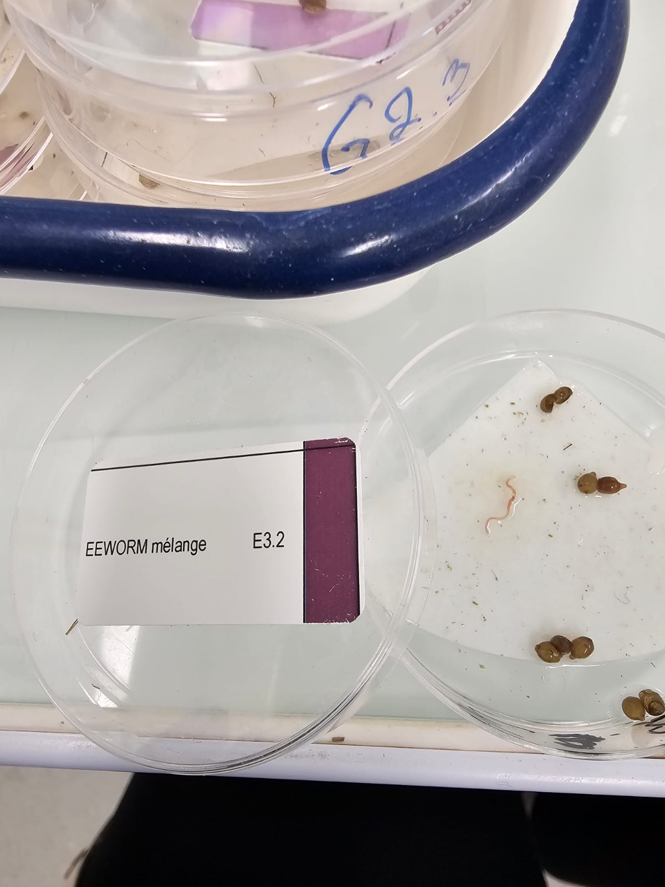
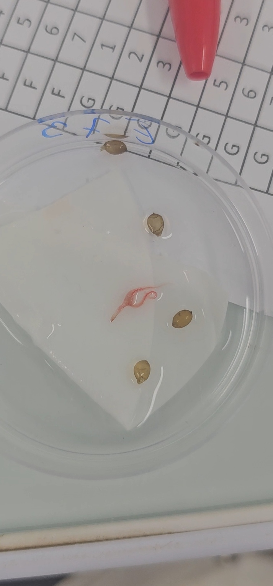
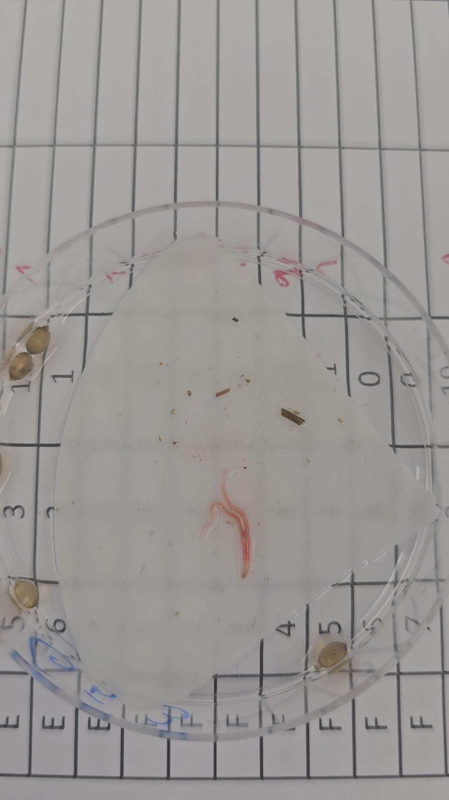
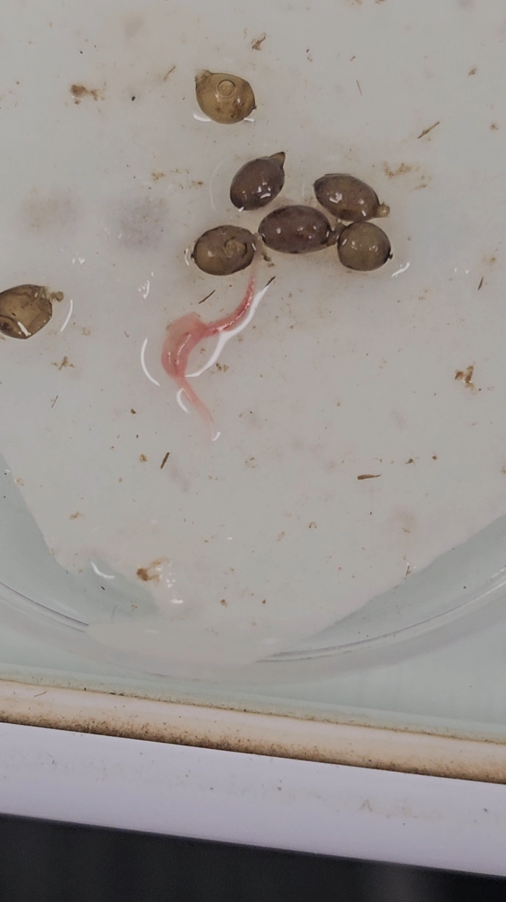

```{r lib, include=F}
library(here)
source(file = here::here("functions/fun.R"))

f_load_libraries_colors()

palette <- colorRampPalette(c("#5E81AC", "#88C0D0"))
col_mix <- Nord_polar[4]
pal_ratio <- c("#88C0D0", col_mix, col_mix, col_mix, "#5E81AC",col_mix)

path_fig <- here::here("fig/Mixture/Spring")
```

# Results of the mixture experiments - Effects on other endpoints

## Data importation

```{r datamix, message = F, warning=F}

# Value given to controls for plot
Val_Ctrl <- 1e-4
Label_Ctrl <- "0 (Ctrl)"


# Data from experiment A (Single substances experiement)
data_expA_repro    <- f_read_data_expA_repro()
df_expA_repro_tot  <- data_expA_repro$df_expA_repro
df_expA_repro      <- data_expA_repro$df_expA_repro_alive
df_expA_repro_mean <- data_expA_repro$df_expA_repro_alive_mean

# Retriving EC50 
df_drc_param <- read.csv(here::here("data/DRC_parameters_cocoons_really_used.csv"))
EPX_EC50_drc <- df_drc_param$coef.drc.4.[3]
IMD_EC50_drc <- df_drc_param$coef.drc.4.[4]

# Data from experiment B (Mixture experiment)
data_expB                 <- f_read_data_expB()
df_expB_growth            <- data_expB$df_expB_growth
df_expB_growth_mean       <- data_expB$df_expB_growth_mean
df_expB_repro             <- data_expB$df_expB_repro
df_expB_repro_mean        <- data_expB$df_expB_repro_mean
df_expB_repro_single      <- data_expB$df_expB_repro_single
df_expB_repro_single_mean <- data_expB$df_expB_repro_single_mean
df_expB_cocsize           <- data_expB$df_expB_cocsize
df_expB_hatch             <- data_expB$df_expB_hatch
df_expB_hatch_mean        <- data_expB$df_expB_hatch_mean

```

## Initial state

We can first take a look at the initial weights of individuals (@fig-initExpBhatch).

```{r D0, warning=F, message=F}
#| fig-cap: Initial weights of earthworms according to batches. 
#| label: fig-initExpBhatch
#| fig-width: 8
#| fig-height: 4

pal_lot <- c(Nord_frost[3], Nord_polar[4])

# Weights at t=0
p <- ggplot(
  data = subset(df_expB_growth, t == 0),
  aes(
    x = Condition,
    y = w
  )
) +
  geom_boxplot(
    alpha = 0.2,
    color = Nord_polar[1]
  ) +
  geom_dotplot(
    aes(
      color = Lot,
      fill = Lot
    ),
    binaxis = "y",
    stackdir = "center",
    dotsize = 0.5,
    alpha = 0.7
  ) +
  scale_color_manual(values = pal_lot) +
  scale_fill_manual(values = pal_lot) +
  labs(x = "Condition", y = "Weight (mg)") +
  theme_classic(12) +
  theme(
    legend.position = "none",
    legend.title = element_text(size = sizetitle - 2, face = "bold"),
    legend.text = element_text(size = sizetitle - 2, face = "plain"),
    title = element_text(size = sizetitle, face = "bold"),
    axis.title.x = element_blank(),
    axis.title.y = element_text(size = sizetitle, face = "plain"),

    # axis.text.x = element_blank(),
    axis.line.x = element_blank(),
    axis.ticks.x = element_blank(),
    strip.background = element_rect(
      color = "black",
      fill = "grey95",
      size = 0,
      linetype = "solid"
    )
  )
p
```

## Effects on growth of individuals

```{r growthcurves, warning=F, message=F}
#| fig-cap: Growth curves of each individual. 
#| label: fig-growthcurves
#| fig-width: 8
#| fig-height: 8

p <- ggplot(
  data = df_expB_growth,
  aes(
    x = t,
    y = w,
    group = ID,
    color = Ratio
  )
) +
  geom_point() +
  geom_line(alpha = 0.7) +
  facet_wrap(~Condition, ncol = 7) +
  scale_color_manual(values = pal_ratio) +
  labs(
    x = "Time (days)",
    y = "Weight of the earthworm (mg)"
  ) +
  theme_bw() +
  theme(
    legend.position = "none"
  )
p

```

```{r savegrowthcurves, include=F}
ggsave(
  filename = "ExpB_growth_curves.png",
  plot = p,
  width = 8, height = 8,
  path = path_fig
)
ggsave(
  filename = "ExpB_growth_curves.svg",
  plot = p,
  width = 8, height = 8,
  path = path_fig
)
```

Batch T is an additional batch of imidacloprid testing performed in early 2025 to confirm the problem came from the soil contamination and not earthworms.

Calculation of growth rates :

```{r calcgrowthrates, message = F, warning=F}
f_growth_rate <- function(data) {
  a_init <- 0.1
  a_i <- c()

  # Calculation of the growth rate for each individual
  for (i in subset(data, t == 0)$ID) {
    data_i <- data.frame(
      L = subset(data, ID == i)$L,
      t = subset(data, ID == i)$t
    )
    L0_i <- subset(data, ID == i & t == 0)$L
    if (length(na.omit(data_i$L)) == 2) { # If only 2 data points
      a.Est <- (subset(data_i, !t == 0)$L - subset(data_i, t == 0)$L) /
        subset(data_i, !t == 0)$t
    } else {
      a.Est <- NA
    }
    a_i <- rbind(a_i, a.Est)
  }
  return(a_i)
}

a_i <- f_growth_rate(df_expB_growth)

df_expB_growth_grate <- cbind(subset(df_expB_growth, t == 0), a_i)
df_expB_growth_grate_mean <- df_expB_growth_grate |>
  aggregate(a_i ~ Condition + Dose_EPX + Dose_IMD + Ratio + TU_drc, FUN = "mean")

```

```{r growthrates, warning=F, message=F}
#| fig-cap: Mean growth rates of each cosm and per condition. 
#| label: fig-growthrates
#| fig-width: 8
#| fig-height: 8

p <- ggplot(
  data = df_expB_growth_grate,
  aes(
    x = "",
    y = a_i,
    # group = Nb_rep,
  )
) +
  geom_boxplot(
    color = Nord_polar[4]
  ) +
  geom_dotplot(
    binaxis = "y",
    stackdir = "center",
    dotsize = 2,
    alpha = 0.7,
    aes(
      color = Ratio,
      fill = Ratio
    )
  ) +
  facet_wrap(
    ~Condition,
    ncol = 7,
    # scales = "free"
  ) +
  # facet_grid(rows = vars(Ratio), cols = vars(Line))+
  # scale_y_log10()+
  scale_color_manual(values = pal_ratio) +
  scale_fill_manual(values = pal_ratio) +
  labs(
    x = "Condition",
    y = expression("Growth rate (mg"^(1 / 3) * "/d)")
  ) +
  theme_bw() +
  theme(
    legend.position = "none"
  )
p
```

```{r savegrates, include=F}
ggsave(
  filename = "ExpB_growth_rates.png",
  plot = p,
  width = 8, height = 8,
  path = path_fig
)
ggsave(
  filename = "ExpB_growth_rates.svg",
  plot = p,
  width = 8, height = 8,
  path = path_fig
)
```

```{r lmcocgrate}
df_grate_lm <- subset(df_expB_growth_grate, !Ratio == "N")

lm.grate <- lm(a_i ~ Ratio:TU_drc, data = df_grate_lm)
summary(lm.grate)
```

There is an effect of all mixtures ratios on growth.

## Effects on reproduction

### Number of cocoons produced

See @sec-MIXSpringJonker for a more detailed analysis.

::: panel-tabset
## Number of cocoons

```{r cocprodbox, warning=F, message=F}
#| fig-cap: Cocoons produced by each cosme and per condition. 
#| label: fig-cocbox1
#| fig-width: 8
#| fig-height: 8

p <- ggplot(
  data = df_expB_repro,
  aes(
    x = "Condition",
    y = Nb_cocoons,
    color = Ratio, 
    fill = Ratio
  )
) +
  # geom_boxplot()+
  geom_dotplot(
    binaxis = "y",
    stackdir = "center",
    dotsize = 2,
    alpha = 0.5
  ) +
  geom_dotplot(
    data = df_expB_repro_mean,
    aes(
      color = Ratio,
      fill = Ratio
    ),
    binaxis = "y",
    stackdir = "center",
    dotsize = 3,
    alpha = 1,
  ) +
  facet_wrap(~Condition, ncol = 7) +
  # facet_grid(rows = vars(Ratio), cols = vars(Line))+
  scale_color_manual(values = pal_ratio) +
  scale_fill_manual(values = pal_ratio) +
  labs(
    x = "Condition",
    y = "Number of cocoons produced in one cosm"
  ) +
  theme_bw() +
  theme(
    legend.position = "none"
  )
p

```

## Number of cocoons per g of earthworm

```{r cocprodbox, warning=F, message=F}
#| fig-cap: Cocoons produced by each cosme per g of earthworm and per condition. 
#| label: fig-cocbox2
#| fig-width: 8
#| fig-height: 8

df_expB_repro <- df_expB_repro |> 
  left_join(df_expB_growth_mean) |> 
  mutate(
    RatioRW = Nb_cocoons/(2*w)
  )

p <- ggplot(
  data = df_expB_repro, 
  aes(
    x = "Condition", 
    y = RatioRW, 
    color = Ratio, 
    fill = Ratio
    )
  )+
  #geom_boxplot()+
  geom_dotplot(
    binaxis='y', 
    stackdir='center', 
    dotsize=2, 
    alpha=0.5
  )+

  facet_wrap(~Condition, ncol = 7)+
  #facet_grid(rows = vars(Ratio), cols = vars(Line))+
  scale_color_manual(values = pal_ratio)+
  scale_fill_manual(values = pal_ratio)+
  labs(
    x = "Condition",
    y = "Number of cocoons produced in one cosm per g of earthworm"
  )+
  theme_bw()+
  theme(
    legend.position = "none"
  )
p

```

```{r, include=F}
ggsave(
  filename = "ExpB_cocoons_per_g_earthworm.png",
  plot = p,
  width = 8, height = 8,
  path = path_fig
)
ggsave(
  filename = "ExpB_cocoons_per_g_earthworm.svg",
  plot = p,
  width = 8, height = 8,
  path = path_fig
)
```
:::

### Cocoons weight

```{r cocweight, warning=F, message=F}
#| fig-cap: Mean weight of cocoons produced by each cosme and per condition. 
#| label: fig-cocbox
#| fig-width: 8
#| fig-height: 8

p <- ggplot() +
  geom_boxplot() +
  geom_dotplot(
    data = df_expB_repro,
    aes(
      x = "",
      y = w_coc,
      color = Ratio,
      fill = Ratio
    ),
    binaxis = "y",
    stackdir = "center",
    dotsize = 2,
    alpha = 0.5
  ) +
  geom_dotplot(
    data = df_expB_repro_mean,
    aes(
      x = "",
      y = w_coc,
      color = Ratio,
      fill = Ratio
    ),
    binaxis = "y",
    stackdir = "center",
    dotsize = 3,
    alpha = 1
  ) +
  facet_wrap(~Condition, ncol = 7) +
  # facet_grid(rows = vars(Ratio), cols = vars(Line))+
  scale_color_manual(values = pal_ratio) +
  scale_fill_manual(values = pal_ratio) +
  labs(
    x = "Condition",
    y = "Mean weight of cocoons produced in one cosm"
  ) +
  theme_bw() +
  theme(
    legend.position = "none"
  )
p

```

```{r savecocoonweight, include=F}
ggsave(
  filename = "ExpB_cocoon_weight.png",
  plot = p,
  width = 8, height = 8,
  path = path_fig
)
ggsave(
  filename = "ExpB_cocoon_weight.svg",
  plot = p,
  width = 8, height = 8,
  path = path_fig
)
```

```{r lmcocw, warning=F, message=F}
df_coc_weight_lm <- subset(df_expB_repro, !Ratio == "N")
lm.cocw <- lm(w_coc ~ Ratio:TU_drc, data = df_coc_weight_lm)
summary(lm.cocw)
```

There is an effect of IMD and EPX as single substances on cocoon weight.

```{r drcweigthcoc, warning=F, message=F}
#| fig-cap: Mean weight of cocoons in cosms exposed to IMD or EPX only. 
#| label: fig-drcweightcoc
#| fig-width: 6
#| fig-height: 6

p_IMD <- ggplot(
  data = subset(df_expB_repro, Dose_EPX == 0),
  aes(
    x = Dose_IMD_plot,
    y = w_coc
  )
) +
  geom_point(
    alpha = 0.5,
    color = col_IMD
  ) +
  geom_point(
    data = subset(df_expB_repro_mean, Dose_EPX == 0),
    aes(
      x = Dose_IMD_plot,
      y = w_coc
    ),
    size = 3,
    color = col_IMD
  ) +
  scale_x_log10(
    breaks = c(Val_Ctrl, 0.01, 0.1, 1, 10, 100),
    labels = c(Label_Ctrl, "0.01", "0.1", "1", "10", "100")
  ) +
  labs(
    x = "Imidacloprid concentration (mg/kg)",
    y = "Mean weight of cocoons\nproduced in one cosm (mg)"
  ) +
  theme_minimal()

p_EPX <- ggplot(
  data = subset(df_expB_repro, Dose_IMD == 0),
  aes(
    x = Dose_EPX_plot,
    y = w_coc
  )
) +
  geom_point(
    alpha = 0.5,
    color = col_EPX
  ) +
  geom_point(
    data = subset(df_expB_repro_mean, Dose_IMD == 0),
    aes(
      x = Dose_EPX_plot,
      y = w_coc
    ),
    size = 3,
    color = col_EPX
  ) +
  scale_x_log10(
    breaks = c(Val_Ctrl, 0.01, 0.1, 1, 10, 100),
    labels = c(Label_Ctrl, "0.01", "0.1", "1", "10", "100")
  ) +
  labs(
    x = "Epoxiconazole concentration (mg/kg)",
    y = "Mean weight of cocoons\nproduced in one cosm (mg)"
  ) +
  theme_minimal()

p <- p_IMD / p_EPX
p

```

```{r savecocweightdrc, include=F}
ggsave(
  filename = "ExpB_cocoon_weight_drc.png",
  plot = p,
  width = 6, height = 6,
  path = path_fig
)
ggsave(
  filename = "ExpB_cocoon_weigth_drc.svg",
  plot = p,
  width = 6, height = 6,
  path = path_fig
)
```

### Cocoons volume

```{r, warning=F, message=F}
#| fig-cap: Correlation between length and width of cocoons produced per conditions.
#| label: fig-cocsizecorr
#| fig-width: 8
#| fig-height: 8

p <- ggplot(
  data = df_expB_cocsize,
  aes(
    x = Coc_height,
    y = Coc_width,
    color = Lot
  )
) +
  geom_point(
    alpha = 0.5
  ) +
  facet_wrap(~Condition, ncol = 7) +
  scale_color_manual(values = pal_lot) +
  scale_fill_manual(values = pal_lot) +
  labs(
    x = "Length of cocoons produced (mm)",
    y = "Width of cocoons produced (mm)"
  ) +
  theme_bw()
p
```

```{r savecocsizecorr, include=F}
ggsave(
  filename = "ExpB_cocoon_size_corr.png",
  plot = p,
  width = 8, height = 8,
  path = path_fig
)
ggsave(
  filename = "ExpB_cocoon_size_corr.svg",
  plot = p,
  width = 8, height = 8,
  path = path_fig
)
```

```{r, warning=F, message=F}
#| fig-cap: Estimated volume of cocoons produced per conditions.
#| label: fig-cocvol
#| fig-width: 8
#| fig-height: 8

p_V <- ggplot(
  data = df_expB_cocsize,
  aes(
    x = "Condition",
    y = v_coc
  )
) +
  geom_boxplot() +
  geom_dotplot(
    aes(
      color = Ratio,
      fill = Ratio
    ),
    binaxis = "y",
    stackdir = "center",
    dotsize = 2,
    alpha = 0.7,
  ) +
  facet_wrap(~Condition, ncol = 7) +
  scale_color_manual(values = pal_ratio) +
  scale_fill_manual(values = pal_ratio) +
  labs(
    x = "Condition",
    y = expression("Estimated volume of cocoons produced (mm"^3 * ")")
  ) +
  theme_bw() +
  theme(
    legend.position = "none"
  )
p_V
```

```{r savecocvolume, include=F}
ggsave(
  filename = "ExpB_cocoon_volume.png",
  plot = p_V,
  width = 8, height = 8,
  path = path_fig
)
ggsave(
  filename = "ExpB_cocoon_volume.svg",
  plot = p_V,
  width = 8, height = 8,
  path = path_fig
)
```

```{r lmcocv, warning=F, message=F}
df_coc_vol_lm <- subset(df_expB_cocsize, !Ratio == "N")

lm.cocv <- lm(v_coc ~ Ratio:TU_drc, data = df_coc_vol_lm)
summary(lm.cocv)
```

No effect on cocoon volume.

```{r drcvolcoc, warning=F, message=F}
#| fig-cap: Mean Volume of cocoons in cosms exposed to IMD or EPX only. 
#| label: fig-drcvolcoc
#| fig-width: 6
#| fig-height: 6

Max_x <- 500

p_IMD <- ggplot(
  data = subset(df_expB_cocsize, Dose_EPX == 0),
  aes(
    x = Dose_IMD_plot,
    y = v_coc
  )
) +
  geom_point(
    alpha = 0.5,
    color = col_IMD
  ) +
  scale_x_log10(
    limits = c(Val_Ctrl, Max_x),
    breaks = c(Val_Ctrl, 0.01, 0.1, 1, 10, 100),
    labels = c(Label_Ctrl, "0.01", "0.1", "1", "10", "100")
  ) +
  labs(
    x = "Imidacloprid concentration (mg/kg)",
    y = expression("Estimated volume of\ncocoons produced (mm"^3 * ")")
  ) +
  theme_minimal()

p_EPX <- ggplot(
  data = subset(df_expB_cocsize, Dose_IMD == 0),
  aes(
    x = Dose_EPX_plot,
    y = v_coc
  )
) +
  geom_point(
    alpha = 0.5,
    color = col_EPX
  ) +
  scale_x_log10(
    limits = c(Val_Ctrl, Max_x),
    breaks = c(Val_Ctrl, 0.01, 0.1, 1, 10, 100),
    labels = c(Label_Ctrl, "0.01", "0.1", "1", "10", "100")
  ) +
  labs(
    x = "Epoxiconazole concentration (mg/kg)",
    y = expression("Estimated volume of\ncocoons produced (mm"^3 * ")")
  ) +
  theme_minimal()

p <- p_IMD / p_EPX
p

```

```{r savecocvoldrc, include=F}
ggsave(
  filename = "ExpB_cocoon_vol_drc.png",
  plot = p,
  width = 6, height = 6,
  path = path_fig
)
ggsave(
  filename = "ExpB_cocoon_vol_drc.svg",
  plot = p,
  width = 6, height = 6,
  path = path_fig
)
```

### Hatchling time and success

Per replicate :

```{r, warning = F, message = F}
#| fig-cap: Cumulative percentage of hatchlings over time since cocoon retrieval per replicate
#| label: fig-hatchcumt
#| fig-width: 6
#| fig-height: 6

p <- ggplot(
  data = df_expB_hatch,
  aes(
    x = t,
    y = Cumul_per_hatch,
    color = Ratio,
    group = ID_rep
  )
) +
  geom_line() +
  geom_abline(
    intercept = 1,
    slope = 0,
    linetype = "dotted",
    color = Nord_polar[4]
  ) +
  facet_wrap(~Condition, ncol = 7) +
  scale_color_manual(values = pal_ratio) +
  scale_fill_manual(values = pal_ratio) +
  labs(
    x = "Time (days)",
    y = "Cumulative percentage of hatchlings"
  ) +
  theme_bw() +
  theme(
    legend.position = "none"
  )
p

```

Per condition :

```{r, warning = F, message = F}
#| fig-cap: Mean cumulative percentage of hatchlings over time since cocoon retrieval per condition
#| label: fig-hatchcumtmean
#| fig-width: 8
#| fig-height: 6

p <- ggplot(
  data = df_expB_hatch_mean,
  aes(
    x = t,
    y = Cumul_perc_hatch,
    color = as.factor(Line),
    group = Condition
  )
) +
  geom_line() +
  geom_abline(
    intercept = 100,
    slope = 0,
    linetype = "dotted",
    color = Nord_polar[4]
  ) +
  facet_wrap(~Ratio, ncol = 7) +
  # scale_color_manual(values = pal_ratio)+
  # scale_fill_manual(values = pal_ratio)+
  scale_color_manual(
    values = rev(nord(palette = "aurora", n = 8)),
    name = "Line"
  ) +
  scale_fill_manual(
    values = rev(nord(palette = "aurora", n = 8)),
    name = "Line"
  ) +
  labs(
    x = "Time (days)",
    y = "Mean cumulative percentage of hatchlings"
  ) +
  theme_bw() +
  theme(
    legend.position = "right"
  )
p

```

```{r savehatch, include=F}
ggsave(
  filename = "ExpB_cocoon_hatch.png",
  plot = p,
  width = 8, height = 6,
  path = path_fig
)
ggsave(
  filename = "ExpB_cocoon_hatch.svg",
  plot = p,
  width = 8, height = 6,
  path = path_fig
)
```

```{r, warning = F, message = F}
#| fig-cap: Mean cumulative percentage of hatchlings over time since cocoon retrieval per condition
#| label: fig-hatchcumtmeansingle
#| fig-width: 8
#| fig-height: 6

p <- ggplot(
  data = subset(df_expB_hatch_mean, Ratio %in% c("E", "I", "N")),
  aes(
    x = t,
    y = Cumul_perc_hatch,
    color = as.factor(Line),
    group = Condition
  )
) +
  geom_line() +
  geom_abline(
    intercept = 100,
    slope = 0,
    linetype = "dotted",
    color = Nord_polar[4]
  ) +
  facet_wrap(~Ratio, ncol = 7) +
  scale_color_manual(
    values = rev(nord(palette = "aurora", n = 8)),
    name = "Line"
  ) +
  scale_fill_manual(
    values = rev(nord(palette = "aurora", n = 8)),
    name = "Line"
  ) +
  labs(
    x = "Time (days)",
    y = "Mean cumulative percentage of hatchlings"
  ) +
  theme_bw() +
  theme(
    legend.position = "right"
  )
p

```

### Observations on hatchlings

A few observations could be made while monitoring hatchlings :

-   Usually, *Aporrectodea caliginosa* gives only one hatchling per cocoon. Here, it happened a few times that there were two. Each time it was seen, one very small earthworm was with a more normal weight earthworm. All occurence could not be witnessed as we could not observe all cocoons hatch.
-   Some hatchlings were really small (@fig-smallhatch1 & @fig-smallhatch2), probably because of the previous point but it could also have happened in cocoons resulting in only one individual.
-   A small number of hatchlings were with malformations like two bodies (happenned twice, @fig-twobodieshatch1, @fig-twobodieshatch2), or anormal masses (happened twice, @fig-cancerhatch).

{#fig-smallhatch1}

{#fig-smallhatch2}

{#fig-twobodieshatch1}

{#fig-twobodieshatch2}

{#fig-cancerhatch}
