# Earthworm culture

## Breeding and experiment soil

| Characteristics                 | Value |
|---------------------------------|-------|
| Clay ( \< 2 µm, g/kg)           | 226.0 |
| Fine silt (2-20 µm, g/kg)       | 174.1 |
| Coarse silt (20-50 µm, g/kg)    | 298.9 |
| Fine sand (50-200 µm, g/kg)     | 239.1 |
| Coarse sand (200-2000 µm, g/kg) | 47.9  |
| $CaCO_3$ total (g/kg)           | 23.3  |
| Organic matter (g/kg)           | 32.6  |
| $P_2O_5$ (g/kg)                 | 0.1   |
| Organic carbon (g/kg)           | 18.9  |
| Total nitrogen (N) (g/kg)       | 1.5   |
| C/N                             | 12.5  |
| pH                              | 7.5   |
| Total $Cu$ (mg/kg)              | 25.2  |

: Main characteristics of the breeding soil from Versailles. Table from @bart_2017a. {@tbl-Clx}

## DNA barcoding

# Experiments

## Growth and reproduction experiments

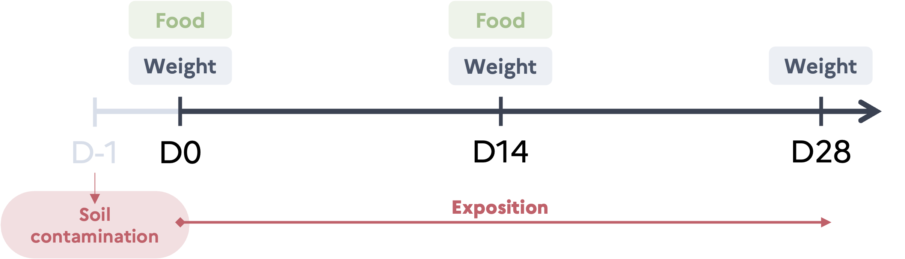{width="50%"}

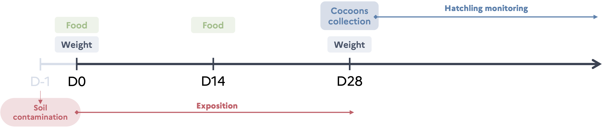{width="80%"}

## Experiment A - Single substance

### Juvenile growth

***Initial state of earthworms***

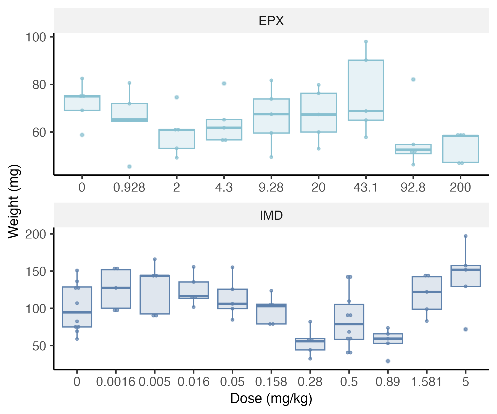

For IMD, there is a significant effect of the dose on earthworm initial weights.

-   ANOVA : pval(IMD) = 9.66e-05,
-   All concentrations are not significatively different from the control (post hoc Dunett test).

However, earthworms were non the less randomly attributed to conditions and the growth model allows to take the differences in initial weight into account.

For EPX, there is no significant effect of the dose on the initial weight of earthworms (Student test : pval(IMD) = 0.125).

***Mortality during the experiment***

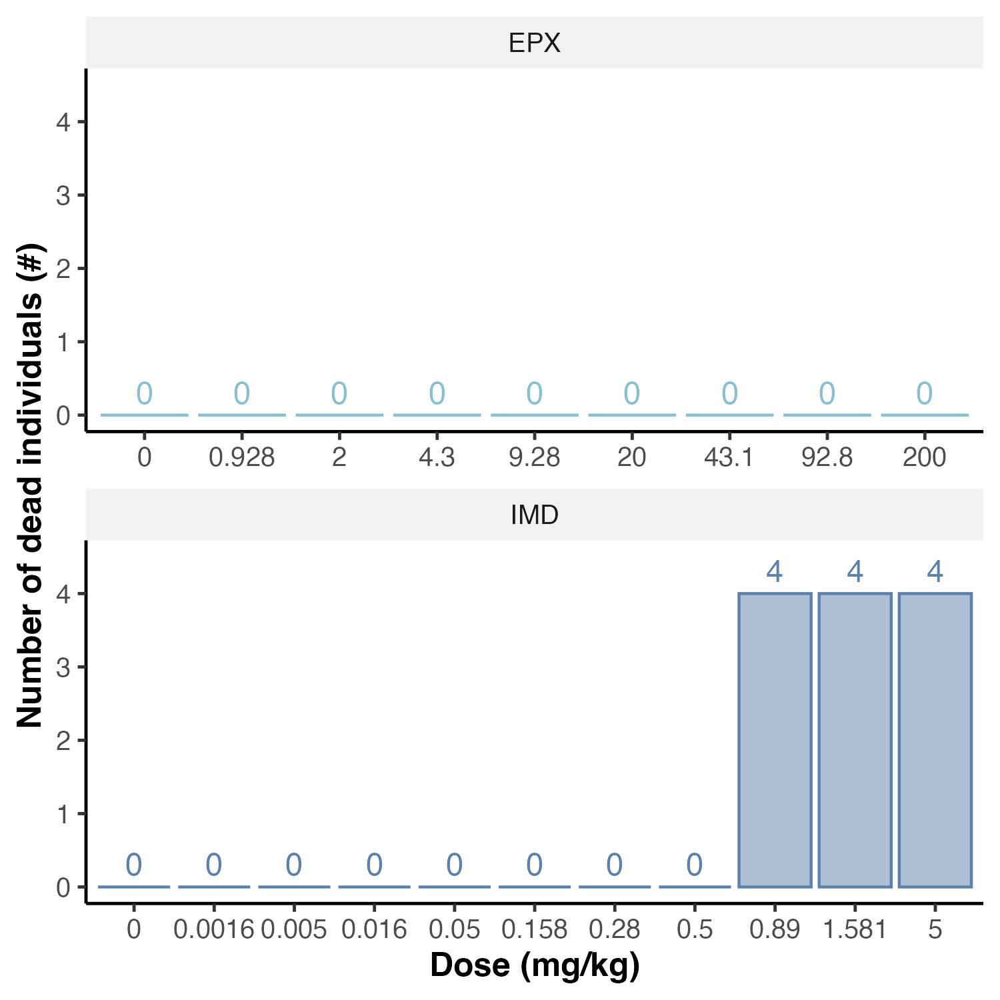{#fig-ExpAGrowthJuvDead}

***Growth curves***

::: {#fig-ExpAGrowthJuv layout-ncol="2"}
{#fig-ExpAGrowthJuvEPX}

{#fig-ExpAGrowthJuvIMD}

Growth curves of juvenile earthworms.
:::

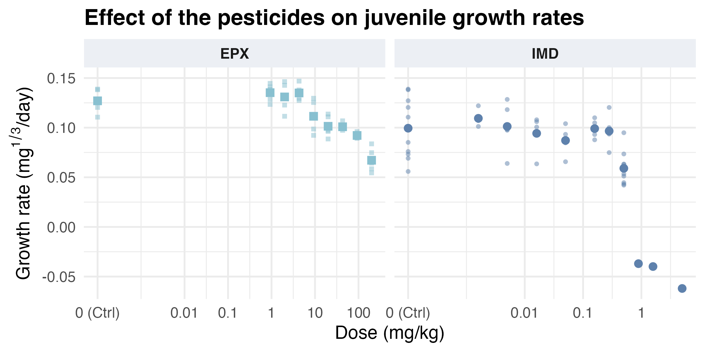

|     | NOEC (mg/kg) | LOEC (mg/kg) |
|-----|--------------|--------------|
| IMD | 0.28         | 0.5          |
| EPX | 9.28         | 20           |

: NOEC and LOEC estimated with a t-test using the Bonferroni adjustment method.

### Reproduction

***Initial state***

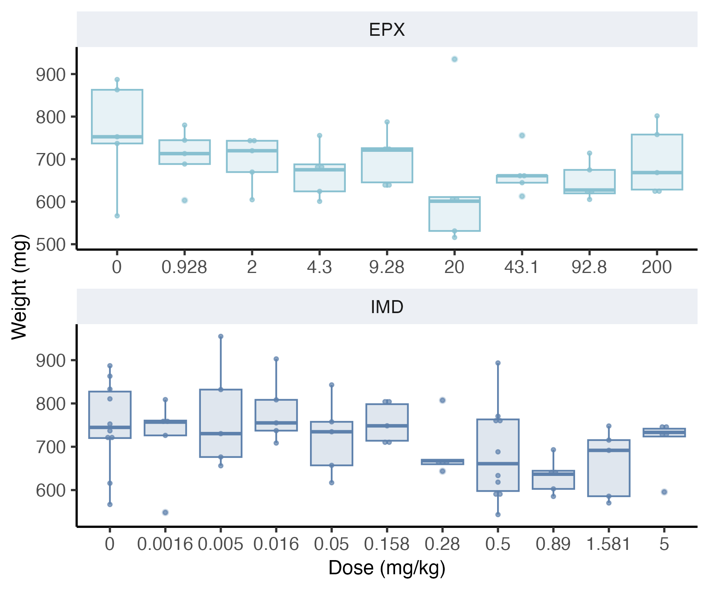

There is no effect of the dose on the initial weight of earthworms (Student test : pval(EPX) = 0.17 & pval(IMD) = 0.573).

***Estimated effect***

|                      | Imidacloprid         | Epoxiconazole          |
|----------------------|----------------------|------------------------|
| Y$_{min}$            | 0 (fixed)            | 0 (fixed)              |
| Y$_{max}$ \[CI 95%\] | 14.3 \[13.0 ; 15.6\] | 18.7 \[16.8 ; 20.7\]   |
| EC$_{50}$ (mg/kg)    | 0.55 \[0.45 ; 0.65\] | 126.8 \[73.6 ; 180.0\] |
| \alpha               | 2.8 \[1.8 ; 3.8\]    | 1.1 \[0.5 ; 1.6\]      |

: Estimated parameters of the dose-response curve for cocoon production of earthworms exposed to Imidacloprid or epoxiconazole and their respective 95% confidence intervals.

Lake-of-fit test : p value = 1.

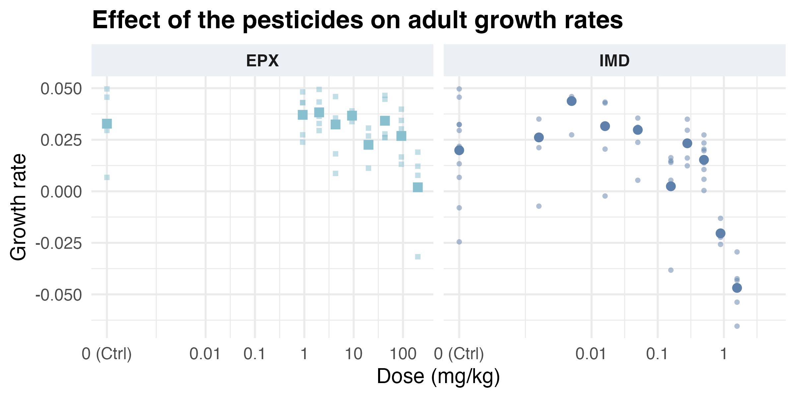

|     | NOEC (mg/kg) | LOEC (mg/kg) |
|-----|--------------|--------------|
| IMD | 0.5          | 0.89         |
| EPX | 92.8         | 200          |

: NOEC and LOEC estimated with a t-test using the Bonferroni adjustment method.

|   | Y$_{min}$ (#) | Y$_{max}$ (#) | Slope | EC$_{50}$ (mg/kg) |
|----|----|----|----|----|
| IMD | Set to 0 | 14.3 \[13.0 ; 15.6\] | 2.8 \[1.8 ; 3.7\] | 0.55 \[0.45 ; 0.65\] |
| EPX | Set to 0 | 18.7 \[16.8 ; 20.7\] | 1.1 \[0.5 ; 1.6\] | 126.8 \[73.6 ; 180.0\] |

: Estimated parameters of the dose-response curves from experiment A.

|   | Y$_{min}$ (#) | Y$_{max}$ (#) | Slope | EC\_{50} (mg/kg) |
|----|----|----|----|----|
| IMD | Set to 0 | 14.3 \[13.0 ; 15.6\] | 1.6 \[0.6 ; 2.5\] | 0.55 \[0.45 ; 0.65\] |
| EPX | Set to 0 | 18.7 \[16.8 ; 20.7\] |  | 126.8 \[73.6 ; 180.0\] |

: Estimated parameters of the dose-response curves from experiment A. Model with common slope.

F-test - Comparison of the dose-response curve models with or without common slope with data normalized with respective controls :

| Model            | Model Df | RSS    | Df  | F value | p value |
|------------------|----------|--------|-----|---------|---------|
| Different slopes | 101      | 118059 |     |         |         |
| Common slope     | 100      | 117776 | 1   | 0.2404  | 0.6250  |

: ANOVA table

## Experiment B - Mixture

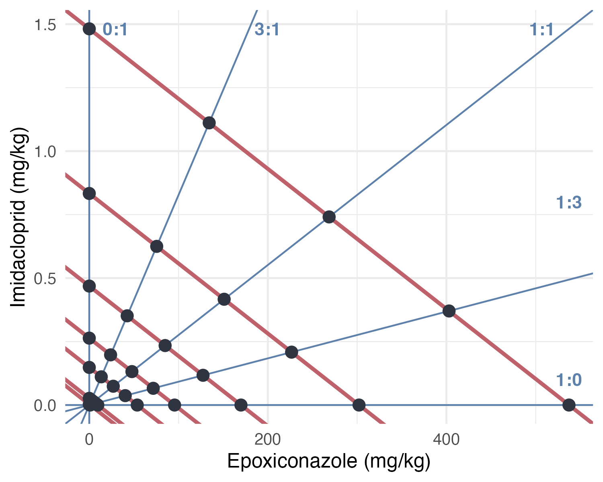

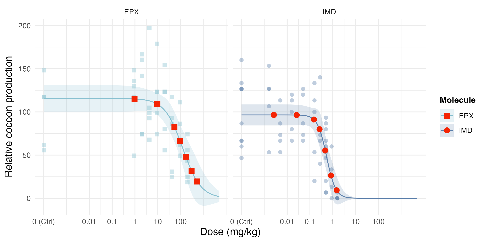

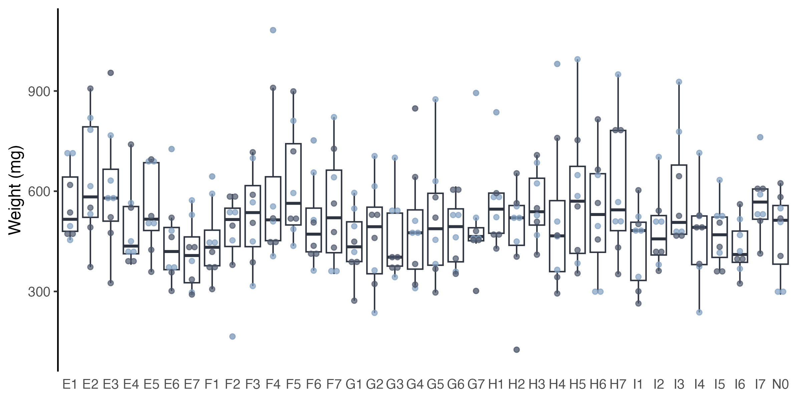

|   | Y$_{min}$ (#) | Y$_{max}$ (#) | Slope | EC$_{50}$ (mg/kg) |
|----|----|----|----|----|
| IMD | Set to 0 | 13.1 \[11.6 ; 14.5\] | 2.3 \[1.6 ; 2.9\] | 0.26 \[0.20 ; 0.33\] |
| EPX | Set to 0 | 13.1 \[11.6 ; 14.5\] | 2.3 \[1.6 ; 2.9\] | 215.6 \[159.9 ; 271.2\] |

: Estimated parameters of the dose-response curves from experiment B (common slope and Y$_{max}$, used in Jonker models.

# Jonker interaction models

## Mathematical formulation

### With CA as reference

Let $f_A$ and $f_B$ be the functions describing the dose-response curves of substance A and substance B, respectively.

In the case of no interaction, concentration addition implies the dose-response surface of the mixture of A and B can be expressed as all couple of concentration of substance A and substance B ($c_A$ ; $c_B$) as :

$$
\frac{c_A}{f^{-1}_A(Y)}+\frac{c_B}{f^{-1}_B(Y)}=1
$$ {#eq-CAbin}

The Jonker simple interaction model add the definition of an interaction parameter ($a$) so the dose-response surface of the mixture of A and B can be expressed as all ($c_A$ ; $c_B$) as :

$$
\frac{c_A}{f^{-1}_A(Y)}+\frac{c_B}{f^{-1}_B(Y)}=\text{exp}(G)
$$ {#eq-jonkerbin}

With :

$$
G(z_A, z_B)=a\times (z_A\times z_B)
$$ {#eq-jonkerbinGSA}

And :

$$
z_i=\frac{\text{TU}_{x_i}}{\text{TU}_{x_A}+\text{TU}_{x_B}},\ \text{ where }\  \text{TU}_{x_i}=\frac{c_i}{EC_{x_i}}
$$ {#eq-jonkerbinZ}

With :

-   $Y$ : The response for a given couple of concentrations,
-   $x$ : Usually 5, 10, ou 50 (50 used in this study),
-   $z_A$ & $z_B$ : Contribution of each substance to the overall effect,

For the SA model, the interaction parameter value describes the type of the interaction :

-   $a$ = 0 : Additivity,
-   $a$ \< 0 : Synergy,
-   $a$ \> 0 : Antagonisme.

The Jonker framework adds two other types of model, making it four models in total :

-   CA : Concentration addition, case with no interaction (@eq-CAbin)
-   SA : Simple interaction with constant deviation from additivity (@eq-jonkerbinGSA),
-   DL : Dose-level dependent interaction where effects vary with response magnitude (@eq-JonkerDLDR),
-   DR : Ratio-dependent interaction where effects vary with mixture composition (@eq-JonkerDLDR).

The DL and DR models include a second interaction parameter, $b$. The expression of $G$ is then :

$$
\begin{aligned}
G(z_Az_B) = \begin{cases}
a\,[1 - b_{DL}]\, z_A z_B & \text{(DL model)}\\[6pt]
(a + b_{DR} z_A)\, z_A z_B & \text{(DR model)}
\end{cases}
\end{aligned}
$$ {#eq-JonkerDLDR}

### With IA as reference

Let $q_i$ be the function as $f_i(c_i) = Y_{max}\ q_i$.

With an endpoint inversely proportional to the dose, the Jonker interaction models can now be expressed as the following equations :

$$
Y = Y_{max}\Phi(\Phi^{-1}[q_A(c_A)*q_B(c_B)]+G)
$$ With :

-   $Y$ : The response for a given couple of concentrations ($c_A$ and $c_B$),
-   $Y_{max}$ : The maximum response (control response),
-   $q_i(c_i)$ : Non-response probability of substance $i$,
-   $\Phi$ : The standard cumulative normal distribution function.

And with :

$$
\begin{aligned}
G(z_A, z_B)=\begin{cases}
a\times z_A z_B & \text{for the SA model} \\
a[1-b\times q_A(c_A)\  q_B(c_B)]\ z_A z_B & \text{for the DL model} \\
(a+b\ z_A)\ z_Az_B & \text{for the DR model} \\
\end{cases}
\end{aligned}
$$

## Computational implementation

### With CA as reference

In practice, the fit of the dose-response curve surface is a double optimization :

1.  For given set of interaction parameters, the corresponding effects must be found also numerically.
2.  Numerical optimization of the interaction parameters

To perform step 1, a function `CA_complete2()` was written. For a given set of interaction parameters, finding the corresponding efect for a couple of concentration ($c_A$ ; $c_B$) implies the minimization of the following term :

$$
\frac{c_A}{f^{-1}_A(Y)}+\frac{c_B}{f^{-1}_B(Y)}-\text{exp}(G)
$$ {#eq-minim}

For step 2, a function `CA_complete_fit_speed()` was written. Parameter estimation for the interaction models requires maximum likelihood estimation (MLE). The optimization procedure depends on the assumed error distribution: for normally distributed errors, this is equivalent to minimizing the residual sum of squares (calculated with the function `CA_complete2_RSS()`), while for Poisson-distributed errors, the log-likelihood function (@eq-LLPoisson) (calculated with the function `CA_complete2_Poisson()`) is directly maximized.

Let $\mathbf{y}=(y_1, y_2, \dots, y_n)$ be the vector of observed responses, $\mathbf{\theta}$ the parameter vector to be estimated, and $f(.|\mathbf{\theta})$ the density function conditional to the parameters. Then, the likelihood function is defined as :

$$
\mathcal{L}(\theta | \mathbf{y})=\prod_{i=1}^nf(y_i|\theta)
$$

The log-likelihood function, which is computationally more tractable, is given by:

$$
l(\theta|\mathbf{y}) = \ln(\mathcal{L}(\theta | \mathbf{y})) = \sum^n_{i=1} \ln(f(y_i|\theta))\\
$$

For count data (cocoon production), assuming $y_i \sim \mathcal{P}(\lambda_i)$ where $\lambda_i = g(\mathbf{x_i}; \theta)$ represents the expected response given covariates $\mathbf{x_i}$, the log-likelihood becomes:

$$
\begin{aligned}
l(\theta|\mathbf{y}) &=\sum^n_{i=1} \ln\left( \frac{e^{-\lambda_i}\lambda_i^{y_i}}{y_i!}\right) \\
&= \sum^n_{i=1} [y_i \ln(\lambda_i) - \lambda_i - \ln(y_i!)]\\
&= \sum^n_{i=1} [y_i \ln(g(x_i;\theta)) - g(x_i;\theta) - \ln(y_i!)]
\end{aligned}
$$ {#eq-LLPoisson}

### With IA as reference

It follows the same principle but the calculation of the effect of the mixture is more straight forward.

## Power analysis

# Application of the Jonker framework on our experimental data

## Dose-response curve prediction for each ratio

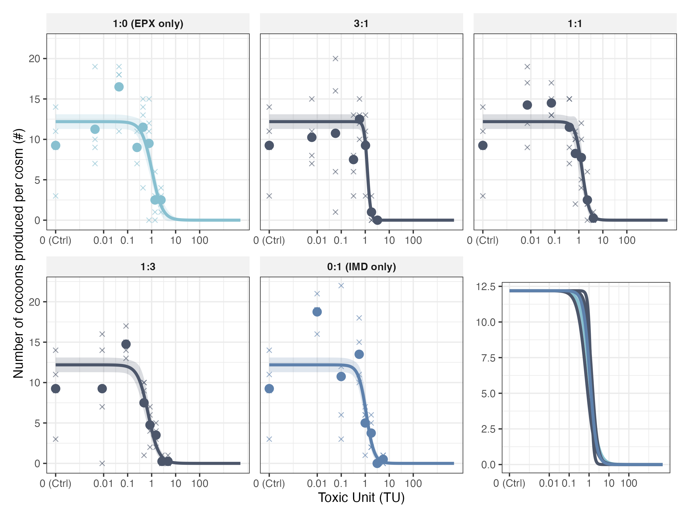

| Parameter                     | Estimate | Std. error |
|-------------------------------|----------|------------|
| $Y_{max}$                     | 12.19    | 0.46       |
| Slope 1:0 (EPX only)          | 2.02     | 0.46       |
| Slope 3:1                     | 6.39     | 1.48       |
| Slope 1:1                     | 2.96     | 0.78       |
| Slope 1:3                     | 1.99     | 0.36       |
| Slope 0:1 (IMD only)          | 2.65     | 0.44       |
| EC$_{50}$ (TU) 1:0 (EPX only) | 1.04     | 0.14       |
| EC$_{50}$ (TU) 3:1            | 1.24     | 0.10       |
| EC$_{50}$ (TU) 1:1            | 1.38     | 0.19       |
| EC$_{50}$ (TU) 1:3            | 0.72     | 0.11       |
| EC$_{50}$ (TU) 0:1 (IMD only) | 1.11     | 0.12       |

: Estimated dose-response curves for each mixture ratios. $Y_{min}$ set to 0.

Lake-of-fit test with likelihood-ratio test : p value = 1.

## Dose-response curves fo the single substance tested during experiment B

|   | Y$_{min}$ (#) | Y$_{max}$ (#) | Slope | EC$_{50}$ (mg/kg) |
|----|----|----|----|----|
| IMD | Set to 0 | 13.1 \[11.2 ; 14.9\] | 2.6 \[1.7 ; 3.4\] | 0.27 \[0.21 ; 0.34\] |
| EPX | Set to 0 |  | 1.8 \[0.9 ; 2.7\] | 201.6 \[131.2 ; 272.0\] |

: Dose-response curves estimated with a different slopes.

|   | Y$_{min}$ (#) | Y$_{max}$ (#) | Slope | EC$_{50}$ (mg/kg) |
|----|----|----|----|----|
| IMD | Set to 0 | 12.8 \[11.1 ; 14.5\] | 2.3 \[1.7 ; 3.0\] | 0.27 \[0.20 ; 0.34\] |
| EPX | Set to 0 |  |  | 221.4 \[162.0 ; 280.8\] |

: Dose-response curves estimated with a common slope.

|           | ModelDf | RSS     | Df  | F value | p value |
|-----------|---------|---------|-----|---------|---------|
| 2nd model | 48      | -489.78 |     |         |         |
| 1st model | 47      | -490.53 | 1   | -0.0712 | 1.0000  |

: F-test between these two model (ANOVA table)

## Mixture model comparisons

| Model type | a | b | Negative Log-Likelihood | AIC |
|----|----|----|----|----|
| CA | \- | \- | 380.2 | 771.5 |
| CA-SA | -0.005 \[-1.08 ; 0.84\] | \- | 380.2 | 773.5 |
| CA-DL | 1.6 \[-0.7 ; 5.5\] | 0.63 \[-156.7 ; 0.65\] | 377.2 | 769.6 |
| CA-DR | -0.40 \[-3.2 ; 2.2\] | 0.9 \[-5.1 ; 6.2\] | 380.1 | 775.2 |
| IA | \- | \- | 383.1 | 776.1 |
| IA-SA | -1.5 \[-3.0 ; -0.2\] | \- | 376.8 | 765.7 |
| IA-DL | -1.9 \[-7.3 ; -0.005\] | 0.6 \[-265.5 ; 2.3\] | 376.6 | 767.3 |
| IA-DR | -1.6 \[-5.6 ; 2.1\] | 0.3 \[-8.25 ; 8.2\] | 376.8 | 767.7 |

: Estimated interaction parameters by the different Jonker interaction models.

Lake-of-fit tests were performed on each model with log-likelihood-ratio tests :

-   Lack-of-fit test CA/Anova: D = 100.223, df = 31, p = 3.198157e-09 (LL_anova: -330.1095; LL_CA: -380.2209; k_anova: 35; k_drc: 4)
-   Lack-of-fit test CA-SA/Anova: D = 100.223, df = 31, p = 3.198295e-09 (LL_anova: -330.1095; LL_CASA: -380.2208; k_anova: 35; k_drc: 4)
-   Lack-of-fit test CA-DL/Anova: D = 94.247, df = 31, p = 2.666283e-08 (LL_anova: -330.1095; LL_CADL: -377.2331; k_anova: 35; k_drc: 4)
-   Lack-of-fit test CA-DR/Anova: D = 100.052, df = 31, p = 3.400474e-09 (LL_anova: -330.1095; LL_CADR: -380.1355; k_anova: 35; k_drc: 4)
-   Lack-of-fit test IA/Anova: D = 105.946, df = 31 , p = 4.009317e-10 (LL_anova: -330.1095; LL_IA: -383.0823; k_anova: 35; k_drc: 4)
-   Lack-of-fit test IA-SA/Anova: D = 92.629, df = 31, p = 4.692054e-08 (LL_anova: -330.1095; LL_IASA: -376.4239; k_anova: 35; k_drc: 4)
-   Lack-of-fit test IA-DL/Anova: D = 92.001 , df = 31 , p = 5.835413e-08 (LL_anova: -330.1095; LL_IADL: -376.1101; k_anova: 35; k_drc: 4)
-   Lack-of-fit test IA-DR/Anova: D = 92.627 , df = 31 , p = 4.694995e-08 (LL_anova: -330.1095; LL_IADR: -376.423; k_anova: 35; k_drc: 4)

|                 | Log-Likelihood     | Df  | p-value |
|-----------------|--------------------|-----|---------|
| CA-SA vs. CA    | 380.2 (CA : 380.2) | 1   | 0.991   |
| CA-DL vs. CA    | 377.2              | 2   | 0.0504  |
| CA-DR vs. CA    | 380.1              | 2   | 0.679   |
| IA-SA vs. IA    | 376.4 (IA : 383.1) | 1   | 0.00026 |
| IA-DL vs. IA    | 376.1              | 2   | 0.00094 |
| IA-DR vs. IA    | 376.4              | 2   | 0.00026 |
| IA-DL vs. IA-SA |                    | 1   | 0.43    |
| IA-DR vs. IA-SA |                    | 1   | 0.97    |

: Comparison of the different models with Likelihood Ratio tests.

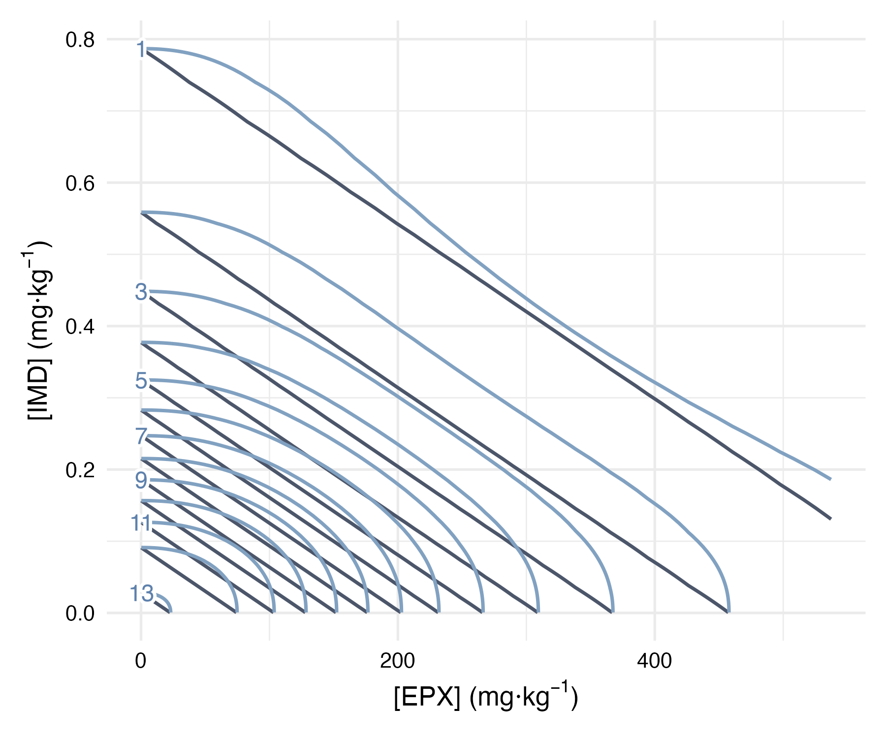

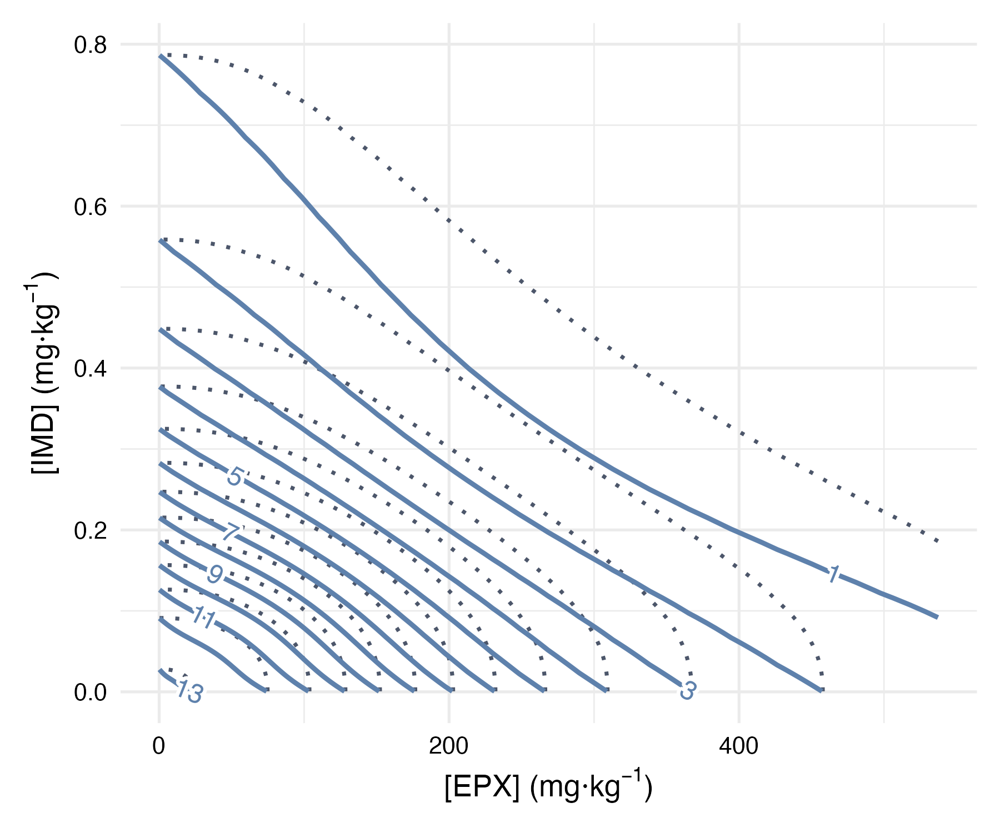

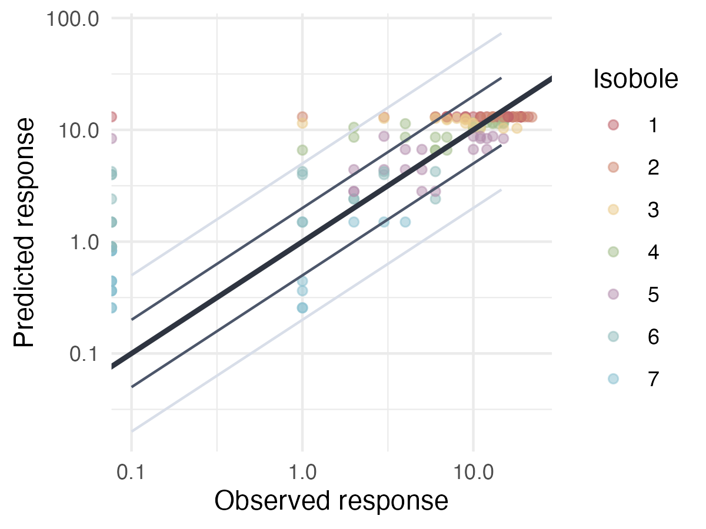

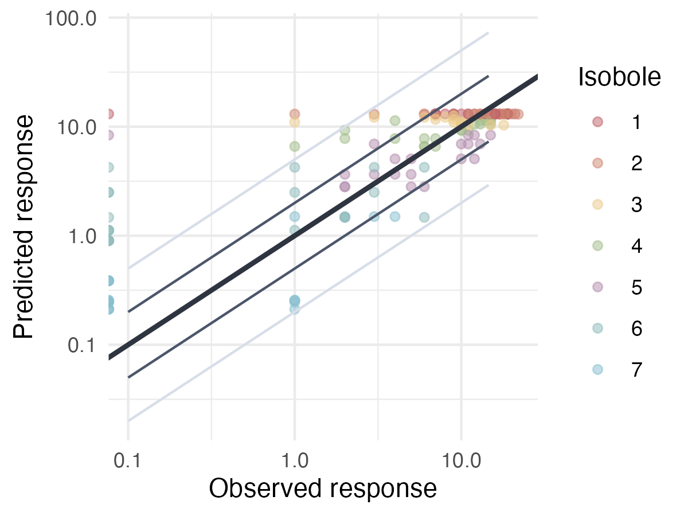

Predicted responses will always be strictly above zero hence the points represented on the left hedge of the plots which correspond to the cosms where no cocoon were found.

# References {.unnumbered}

::: {#refs}
:::
